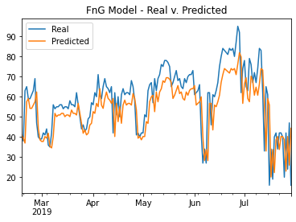
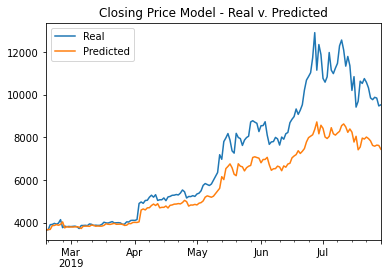

# LSTM Stock Predictor

## Questions

* Which model has a lower loss?

    * The FnG Model has the lowest loss after experimenting with multiple window sizes and epochs
    * FnG Model Loss = 0.0159

* Which model tracks the actual values better over time?

    * The Fng Model is a better predictor
        * 
    * For reference, the closing price model:
        * 

* Which window size works best for the model?

    * After running all windows sizes [0-10], both models performed best with window sizes equal to 1

